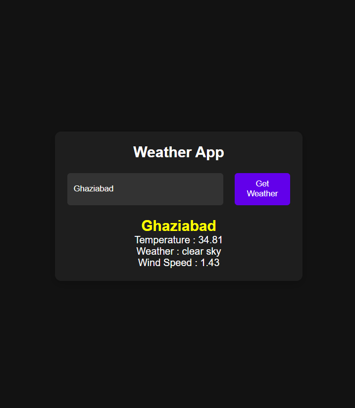

# 🌤️ Weather App

A simple, lightweight weather web app built with plain **HTML, CSS and JavaScript**. Enter a city name and get its current weather: temperature, a short description and wind information. If the city can't be found, the app shows a friendly error message.

**Author:** Abhinav Kumar ([@Abhinavkr004](https://github.com/Abhinavkr004))
**Repository:** https://github.com/Abhinavkr004/Weather-App

---

## ✨ Features

- 🔍 Search weather by city name
- 🌡️ Displays temperature
- 📝 Shows a weather description
- 💨 Shows wind information
- ⚠️ "City not found" error message for invalid searches
- 🧩 No frameworks or build step; runs directly in the browser

## 🛠️ Tech Stack

| Layer     | Technology                         |
| --------- | ---------------------------------- |
| Structure | HTML5                              |
| Styling   | CSS3                               |
| Logic     | Vanilla JavaScript (DOM + Fetch)   |

## 📂 Project Structure

```
Weather-App/
├── index.html    # Page layout: input, button, weather info, error message
├── script.js     # Fetches weather data and updates the DOM
└── styles.css    # App styling
```

### UI elements (`index.html`)

| Element ID         | Purpose                                         |
| ------------------ | ----------------------------------------------- |
| `city-input`       | Text field to type the city name                |
| `get-weather-btn`  | Button that triggers the weather lookup         |
| `weather-info`     | Result container (hidden until data is loaded)  |
| `city-name`        | Displays the city name                          |
| `temperature`      | Displays the temperature                        |
| `description`      | Displays the weather description                |
| `windy`            | Displays wind details                           |
| `error-message`    | Shown when the city is not found                |

## 🚀 Getting Started

1. **Clone the repository**
   ```bash
   git clone https://github.com/Abhinavkr004/Weather-App.git
   cd Weather-App
   ```

2. **Add your API key (if required)**
   Open `script.js` and make sure the weather API key is set to your own key.

3. **Run the app**
   Open `index.html` in any modern browser, or use a local server such as the VS Code *Live Server* extension.

## 🧭 How It Works

1. The user types a city name into the input box.
2. Clicking **Get Weather** sends a request to the weather API.
3. On success, the city name, temperature, description and wind info are filled in and the result section is revealed.
4. On failure, the result section stays hidden and **"City not found. Please try again."** is displayed.

## 🔮 Future Improvements

- Humidity, "feels like" and pressure details
- Weather icons and dynamic backgrounds
- Current-location weather using the Geolocation API
- 5-day forecast
- °C / °F toggle
- Press **Enter** to search

## 🤝 Contributing

Suggestions and pull requests are welcome. Fork the repo, create a branch and open a PR.

## 📄 License

This project is created for **educational purposes only**.

## 🖼️ Preview
 

 
*Screenshot of the Weather App showing the city search and current weather result.*
